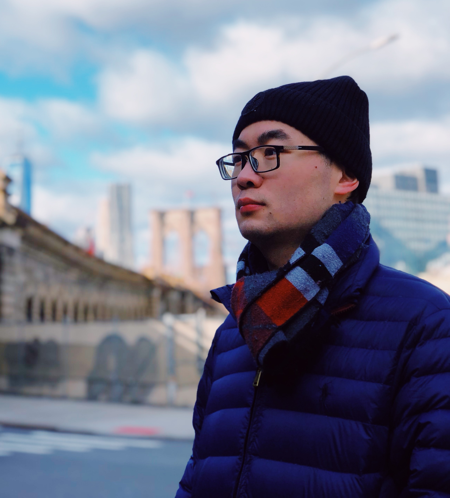

<!-- 设置分栏的方法来自于：https://www.v2ex.com/t/132636 
设置图片边框：https://blog.csdn.net/ProgramChangesWorld/article/details/51702679
-->

	

<!-- 注释

 

-->

# <small>Yuyang WANG</small> 

	<a href="mailto:alwyuyang@gmail.com">alwyuyang (at) gmail (dot) com</a>
	 
	<a href="https://github.com/yywangvr" >
	  <i class="fa fa-github"> </i>
	</a>
	<a href=" https://www.linkedin.com/in/yywangvr/" >
	 <i class="fa fa-linkedin" aria-hidden="true"></i>
	</a>
	<a href="https://twitter.com/yyuwang_" >
	<i class="fa fa-twitter"> </i>
	</a>
    		

	

<!-- 注释
[alwyuyang (at) gmail (dot) com](mailto:alwyuyang@gmail.com)
<a href="https://github.com/yywangvr" >
  <i class="fa fa-github"> </i>
</a>
<a href=" https://www.linkedin.com/in/yywangvr/" >
 <i class="fa fa-linkedin" aria-hidden="true"></i>
</a>
<a href="https://twitter.com/yyuwang_" >
<i class="fa fa-twitter"> </i>
</a>
-->

 
 I am a Ph.D. student with diverse background from Bachelor to Ph.D. study, enabling me to perform interdisciplinary research. My research activities focus on customized interaction techniques in virtual reality by involving human factors (cybersickness, emotion, *etc.*).

----

##<small>Research interests</small>

- Reduction of cybersickness by designing new navigation interface
- Customized computer-human interaction (CHI) by involving human factors from verbal feedback or physiological signals 
- Multi-sensory VR interaction based on cognitive systems and affective computing
- Evaluation of user experience during CHI process
- Multiphysics modeling and simulation based on numerical methods

Research methodology relies on `theoretical inference/simulation` and `user study` supported by statistics, signal processing, machine/deep learning, control theory and numerical modeling, *etc.*.

----

##<small>Education</small>
`November 2017 - October 2021 `

- __PhD__

- [Image institute](http://institutimage.ensam.eu/homepage-institut-image-102267.kjsp?RH=1417091979616&RF=1417092040212) , [Arts et metiers institute of technology](https://artsetmetiers.fr), France
- Keywords: virtual reality (VR), navigation/locomotion, interaction, cybersickness, cognitive workload, subjective evaluation, optimal control, data-driven modeling, deep learning
- Thesis: Intelligent navigation in virtual reality (defended: [video](https://youtu.be/JGA4uBs61dc))

`October 2019 - September 2020`

- __Visiting PhD student__

- Institute for Information Management in Engineering ([IMI](https://www.imi.kit.edu)), [Karlsruhe Institute of Technology](https://www.kit.edu/english/index.php), Germany
- Keywords: VR, interaction, fuzzy logic, user modelling, human factors

`September 2015 - July 2017`

- __Master on numerical methods in engineering__

- International Centre for Numerical Methods in Engineering ([CIMNE](https://www.cimne.com)), [Polytechnic University of Catalonia](https://www.upc.edu/en/homepage), Spain
- Numerical methods including finite element method, advanced discretization methods, numerical methods for PDEs, domain decomposition and large scale computing, *etc.*
- Applications focus on computational structural mechanics and dynamics, continuum mechanics, fluid mechanics and dynamics, forming processes and electromagnetism, *etc.*
- Thesis: Development of a numerical model for the transport of dust, [file in PDF](/media/masterThesis.pdf) 

`September 2011 - July 2015`

-  __Bachelor of non-woven materials in engineering, *summa cum laude*__

- College of Textile and Clothing Engineering, [Soochow University](https://www.suda.edu.cn/eng/), China
- Keywords: engineering mechanics, polymeric chemistry & physics, textile materials, polymer structure & properties, technology of synthetic fibers
- Thesis: Intelligent wearable devices for textile sensory evaluation

----

##<small>Funding and awards</small>
`October 2019 - September 2020`

- __Scholarship from the French-German institute for the industry of future__

`January 2020 - June 2020`

- __Erasmus+ mobility grant from the HESAM Université__

`July 2015 `

- __Excellent Graduates of Soochow University__

`November 2013 `

- __National scholarship from the Ministry of Education of the PRC__

----

##<small>Community service</small>

- Organizer of BoF session, "Towards real-time evaluation of cyber-sickness in VR", April 2021, IEEE VR,      [Online](https://ieeevr.org/2021/program/bofs/)
- Reviewer of international conferences: IEEE VR, IEEE ISMAR, ACM VRST
- Reviewer of international journals: IEEE Transactions on Visualization and Computer Graphics, Textile Research Journal, Industria Textila Journal

----

##<small>Invited talk</small>

	
- Intelligent naivgation in virtual reality. November 2021, ParisTech Elite Institute of Technology at Shanghai Jiao Tong University,  China	
- Development of navigation techniques in virtual reality: towards customized interaction. December 2020, Hefei University of Technology, China, [Online](http://www.hfut.edu.cn/info/1036/6935.htm)
- Introduction to virtual reality. August 2018, the 2nd International Youth Innovation Conference, China

----

	

##<small>Computer skills</small>

- Language: C# (Unity3D), Python, Matlab, C++, Latex 
- Parallel/distributed computing framework using OpenMP, Open MPI, [Ray](https://ray.io) 
- AI programming relying mainly on Tensorflow and Keras

---

##<small>Hobbies</small>

- Badminton and Chinese chess since childhood
- Piano during confinement of Covid-19

----

##<small>Publications</small>

----

<!-- 地球仪统计访客信息-->

<!-- 访客统计：

-->

<!-- 通过邮箱联系我： contact form-->

<!-- 分享到社交媒体: social media icons, 暂时不用了。

-->

<!-- Go to www.addthis.com/dashboard to customize your tools -->

